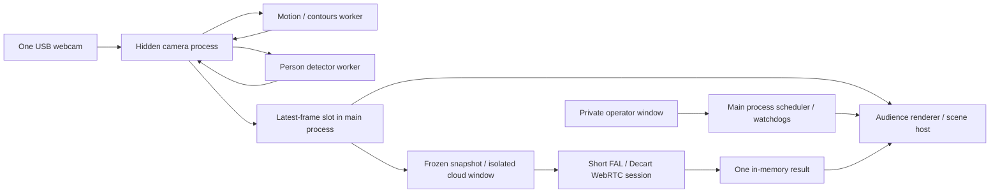

# Architecture

Electron provides a macOS/Linux desktop shell, native output-display enumeration, full-screen windows, permissions, isolated renderer processes, and a separate operator console. Canvas 2D supplies the visuals; bundled MediaPipe/EfficientDet-Lite0 supplies local person detection. Native browser media capture is shared by all scenes. No local HTTP server or open control port is required; a restricted `reverie://app/` protocol serves packaged assets.

## Failure boundaries and budgets

The main process owns scheduling using a monotonic clock, settings, windows, log rotation, credentials and cloud spending reservations. Scene deadlines continue when the camera, detector or cloud is unavailable. Independent camera/renderer heartbeats restart lost or unresponsive processes with a 1.5-second delay. The cloud window has a main-process hard lifetime; its termination also disposes WebRTC resources even if its JavaScript stalls.

The engine captures at up to 30 fps. Publishing waits for an IPC acknowledgement; the main process holds only the newest frame. The audience has at most one frame request outstanding. Motion and inference each have a single in-flight job, with no accumulated work queue. Detection is sampled every 300/400/650 ms; motion every 65/90/140 ms according to quality. Old analysis is expired at 1.5 seconds; old boxes at 1.6 seconds; the rendered camera at two seconds. Stalled video is reopened after 4.5 seconds. No persistent tracks are maintained.

| Resource | Bound |
|---|---|
| Camera plane | 960×540 / 640×360 / 480×270 |
| Local motion/edge plane | 384×216 / 256×144 / 160×90 |
| Output canvas | 1920×1080 / 1600×900 / 1280×720; CSS contains it on the display |
| Detection | 24 boxes; COCO person only, score ≥0.34 |
| Motion | 24×14 grid; 48 strongest motion points; 24 occupied still points |
| Monsters | 7 chasers + up to 12 audience overlays |
| Bubbles | 110 / 80 / 45; maximum lifetime 8 seconds |
| Pop bursts | 28, fading within 0.6 seconds |
| Garden | 210 / 140 / 70 plants; maximum lifetime 42 seconds; 12 butterflies |
| Transition | One old render snapshot, 1.4 seconds; no second active scene |
| Cloud | One job; one current frozen input; one cached output; no queue |
| Logs | 80 in-memory entries; approximately 2 MiB on disk |

Automatic quality steps down after three one-second samples below 25 fps and steps up after twenty above 28 fps. Lowering quality reduces capture resolution, analysis rate and effect counts along with output resolution. The 30 fps metric counts rendered frames, not guaranteed camera acquisition fps or measured projector scanout. IPC and GC overhead remain platform dependent.

## Coordinate contract

The engine aspect-contains the sensor in a 16:9 camera plane and applies optional mirroring **before** motion and detection. All scenes receive this same plane. Normalized x/y are top-left origin, range approximately 0–1; box extents can reach an edge for partially visible people. Drawing maps them through `x*w, y*h` with no scene-specific crop. There is no identity, demographic or physical-depth field.

`FramePacket`: `{seq, at, width, height, pixels, boxes, motion, demo}`. `seq` is per-engine monotonic; `at` is a wall-clock timestamp for age checks. `pixels` is RGBA `Uint8ClampedArray`. `boxes` are `{x,y,w,h,score}`; score is detector confidence, not a calibrated probability. Spatial smoothing matches nearby boxes for one inference update only and discards unmatched old boxes; it does not establish identities. `motion` includes `{points,calm,amount,energy,edges,width,height,cols,rows,at}`. Points contain `{x,y,strength}`. `amount` is normalized smoothed grayscale change after a noise floor and global illumination correction, not percentage of people moving. Grid occupancy is tested against the current person boxes. Stillness needs >2.5 seconds of low local change, accumulates to ten seconds, and decays slowly through brief movement; unoccupied regions decay faster.

## Scene lifecycle and context

`initialize(context)` allocates resources; `activate(context)` starts the scene; `update(context)` advances simulation; `render(canvas2D, context)` draws; `deactivate()` ends activity; `cleanup()` releases resources. All methods must be synchronous, short and idempotent for cleanup. Each activation uses a fresh instance. `SceneHost` catches lifecycle/update/render exceptions, cleans up, quarantines the ID for the renderer lifetime and lets the scheduler continue. A hard infinite loop is recovered by restarting the audience process, not by catching an exception. No scene may own a camera, network session or accumulating request queue.

Context: `{w,h,time,dt,quality,intensity,frame,analysis,robotImage,demo}`. `time` and `dt` are seconds; `dt` is clamped to 0.1; quality is 0/1/2. `frame` is a shared CanvasImageSource or null. `analysis` has `{boxes,motion}` with empty, safe defaults when unavailable. `robotImage` is the latest decoded cloud still, if any. Inputs are read-only by convention. Scene resources and simulations must tolerate changes in w/h and quality without allocating per-frame textures.

## Security and data lifecycle

Renderers have context isolation, sandboxing and no Node integration. Preloads expose role-specific IPC only; main-process handlers check sender identity. Only the engine can request camera permission, and audio is not requested. Local windows have a self-only network CSP; only the isolated robot window has FAL signaling network permissions. The root key stays in main; a short-lived model-scoped token is minted for each job. Windows cannot navigate to arbitrary content or open new windows. No telemetry or automatic updater is configured.

Audience inputs/results remain in memory; only settings, budget timestamps and controlled status text persist. FAL/Decart retention and handling are outside the local application's control; enabling the robot feature sends the frozen image off-device. PNG test snapshots are generated only by explicit test scripts with synthetic media. The private `.env` is access-restricted but unencrypted. Native permission decisions remain under OS control.
