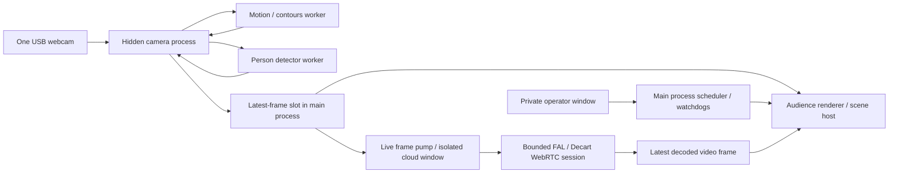

# Architecture

Electron provides a macOS/Linux desktop shell, native output-display enumeration, full-screen windows, permissions, isolated renderer processes, and a separate operator console. Canvas 2D supplies the visuals; bundled MediaPipe/EfficientDet-Lite0 supplies local person detection. Native browser media capture is shared by all scenes. No local HTTP server or open control port is required; a restricted `reverie://app/` protocol serves packaged assets.

## Failure boundaries and budgets

The main process owns scheduling using a monotonic clock, settings, windows, log rotation, credentials and cloud spending reservations. Scene deadlines continue when the camera, detector or cloud is unavailable. Independent camera/renderer heartbeats restart lost or unresponsive processes with a 1.5-second delay. The cloud window has a main-process hard lifetime; its termination also disposes WebRTC resources even if its JavaScript stalls.

Audience placement ignores Dock/menu-bar work-area notifications and applies only changed output geometry. Native full-screen transitions are serialized through their completion events; monitor changes during an animation replace the pending layout. Repeated display notifications and reopening the audience view preserve manual full-screen choices. Hidden output stays hidden until explicitly reopened.

The engine captures at up to 30 fps. Publishing waits for an IPC acknowledgement; the main process holds only the newest frame. The audience has at most one frame request outstanding. Motion and inference each have a single in-flight job, with no accumulated work queue. Detection is sampled every 300/400/650 ms; motion every 65/90/140 ms according to quality. Old analysis is expired at 1.5 seconds; old boxes at 1.6 seconds; the rendered camera at two seconds. Stalled video is reopened after 4.5 seconds. No persistent tracks are maintained.

| Resource | Bound |
|---|---|
| Camera plane | 960×540 / 640×360 / 480×270 |
| Local motion/edge plane | 384×216 / 256×144 / 160×90 |
| Output canvas | 1920×1080 / 1600×900 / 1280×720; CSS contains it on the display |
| Bay and garden artwork canvas | 960×540 / 800×450 / 640×360; upscaled once inside the full-resolution portal; released when leaving artwork scenes |
| Detection | 24 boxes; COCO person only, score ≥0.34 |
| Motion | 24×14 grid; 48 strongest motion points; 24 occupied still points |
| Small wonderful things | Six independently animated sprite characters, six poses each, bounded travel lanes and action cooldowns; 120 ms motion gate; water-only GPU pass |
| Bubbles | 32 / 24 / 16; maximum lifetime 5 seconds |
| Bay ripples / splashes | 8 ripples fading within 1.4 seconds; 56 splash droplets fading within 0.65 seconds |
| Garden | 112 / 80 / 48 plants; maximum lifetime 46 seconds; 12 butterflies; cached botanical artwork and foliage |
| Transition | One old render snapshot, 1.4 seconds; no second active scene. Artwork entry uses an opaque scene-colored wash instead of the preceding camera scene. |
| Cloud | One live connection; one input and one output frame; one IPC in flight per direction; no queue |
| Logs | 80 in-memory entries; approximately 2 MiB on disk |

Automatic quality steps down after three one-second samples below 25 fps and steps up after twenty above 28 fps. Lowering quality reduces capture resolution, analysis rate and effect counts along with output resolution. The 30 fps metric counts rendered frames, not guaranteed camera acquisition fps or measured projector scanout. IPC and GC overhead remain platform dependent.

## Coordinate contract

The engine aspect-contains the sensor in a 16:9 camera plane and applies optional mirroring **before** motion and detection. All scenes receive this same plane. Normalized x/y are top-left origin, range approximately 0–1; box extents can reach an edge for partially visible people. Drawing maps them through `x*w, y*h` with no scene-specific crop. There is no identity, demographic or physical-depth field.

Artwork scenes request a compact packet containing only `{seq, at, demo, boxes, motion: {points, calm, amount}}`. Camera pixels, edge maps, energy grids and previews stay out of the audience renderer for these scenes. In-flight packets in the wrong format are discarded across camera/artwork transitions; the shared full packet remains available for camera scenes and robot prewarming.

`FramePacket`: `{seq, at, width, height, pixels, boxes, motion, demo}`. `seq` is per-engine monotonic; `at` is a wall-clock timestamp for age checks. `pixels` is RGBA `Uint8ClampedArray`. `boxes` are `{x,y,w,h,score}`; score is detector confidence, not a calibrated probability. Spatial smoothing matches nearby boxes for one inference update only and discards unmatched old boxes; it does not establish identities. `motion` includes `{points,calm,amount,energy,edges,width,height,cols,rows,at}`. Points contain `{x,y,strength}`. `amount` is normalized smoothed grayscale change after a noise floor and global illumination correction, not percentage of people moving. Grid occupancy is tested against the current person boxes. Stillness needs >2.5 seconds of low local change, accumulates to ten seconds, and decays slowly through brief movement; unoccupied regions decay faster.

## Scene lifecycle and context

`initialize(context)` allocates resources; `activate(context)` starts the scene; `update(context)` advances simulation; `render(canvas2D, context)` draws; `deactivate()` ends activity; `cleanup()` releases resources. All methods must be synchronous, short and idempotent for cleanup. Each activation uses a fresh instance. `SceneHost` catches lifecycle/update/render exceptions, cleans up, quarantines the ID for the renderer lifetime and lets the scheduler continue. A hard infinite loop is recovered by restarting the audience process, not by catching an exception. No scene may own a camera, network session or accumulating request queue.

Context: `{w,h,time,dt,quality,intensity,frame,analysis,robotVideo,demo}`. `time` and `dt` are seconds; `dt` is clamped to 0.1; quality is 0/1/2. `frame` is a shared CanvasImageSource or null. `analysis` has `{boxes,motion}` with empty, safe defaults when unavailable. `robotVideo` is the canvas containing the latest decoded Lucy video frame, if any. Inputs are read-only by convention. Scene resources and simulations must tolerate changes in w/h and quality without allocating per-frame textures.

Only the garden renders its artwork at half the output width and height, using 75% fewer artwork pixels while keeping the border and branding at normal output resolution. Plant counts and animation timing are unchanged. During this scene, `frame(seq, true)` returns `{seq,at,demo,boxes,motion:{points,calm,amount}}`; camera pixels, edges, energy grids and JPEG previews are omitted before IPC serialization, and the audience does not upload camera images. The engine still supplies normal local motion/person analysis and retains its full packet for other scenes and robot prewarming. Scene changes refetch the correct packet format and discard requests that finish after their format becomes obsolete.

## Security and data lifecycle

Renderers have context isolation, sandboxing and no Node integration. Preloads expose role-specific IPC only; main-process handlers check sender identity. Only the engine can request camera permission, and audio is not requested. Local windows have a self-only network CSP; only the isolated robot window has FAL signaling network permissions. The root key stays in main; a short-lived model-scoped token is minted for each job. Windows cannot navigate to arbitrary content or open new windows. No telemetry or automatic updater is configured.

Audience inputs/results remain in memory; only settings, budget timestamps and controlled status text persist. FAL/Decart retention and handling are outside the local application's control; enabling the robot feature streams the live camera off-device while the scene connects and plays. PNG test snapshots are generated only by explicit test scripts with synthetic media. The private `.env` is access-restricted but unencrypted. Native permission decisions remain under OS control.

## Robot availability

The scheduler excludes robots until the first live video frame is decoded by the audience renderer and acknowledged to main. Planned order drives prewarming 15 seconds before the slot. Manual selection requests a connection and waits on the current scene until video arrives. Failed connections clear availability and the latest output; other enabled scenes continue. A robot-only unavailable playlist uses neutral ambient output (`active: null`). The operator gets the skip reason, error code, stage and spending-limit state.

The hidden robot window pulls fresh shared-camera frames at up to 30 fps and paints a 1280×720 WebRTC input canvas. A `requestVideoFrameCallback` on Lucy's returned video publishes decoded 960×540 RGBA frames at up to 24 fps, with one acknowledged IPC in flight. Main retains only the latest frame and stamps its arrival time. Audience pulls it into a separate canvas and renders that current canvas every frame. Old-session IDs and non-increasing frame sequences are rejected. Camera and returned-video freshness expire after two seconds; no timer repaint can impersonate a newly decoded remote frame.

Main enforces 25 seconds for connection setup. Once displayed, the stream is bounded by the configured scene duration even if the operator pauses or reselects the scene. Setup plus prewarming plus playback is bounded by duration plus 40 seconds. Scene exit, display/camera loss, settings cancellation and app quit first remove the scene, then send a stop message to the isolated service. The service immediately stops media and closes its single-use signaling socket with code 1000. It waits for the socket close event, bounded at four seconds, and reports the close code and whether the handshake was clean. Main retains the connection lock until that result, or forces teardown after five seconds. A clean signaling close still does not confirm that the upstream provider released its concurrency quota. Audience recovery starts without a cached result. FAL credentials are scoped to `lucy-2-5` and expire after 120 seconds, longer than the maximum connection lifetime; no refresh/reconnect loop is used.

Concurrency rejections before video arrives are classified as `SESSION_BUSY`. The attempt remains in session and rolling-hour caps, while its scene-interval reservation is rolled back to the prior attempt. A persisted 60-second wait and manual-retry requirement prevent automatic retries, including after restart. Retrying never bypasses prior-session intervals, scene enablement, camera freshness or spending caps.
